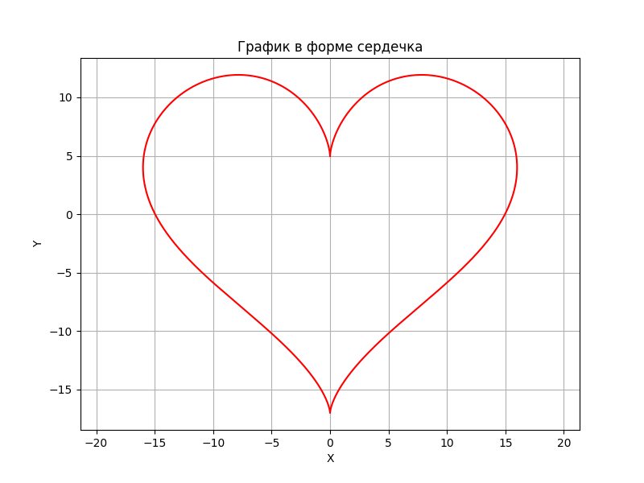

Минимальный проект для сдачи работы #2 по курсу "Программная инженерия" 

Фронтенд:
```commandline
cd my-flask-app
npm start
```

Приветствие:
```commandline
http://127.0.0.1:5000
```
Построение графика:
```commandline
http://127.0.0.1:5000/plot
```
