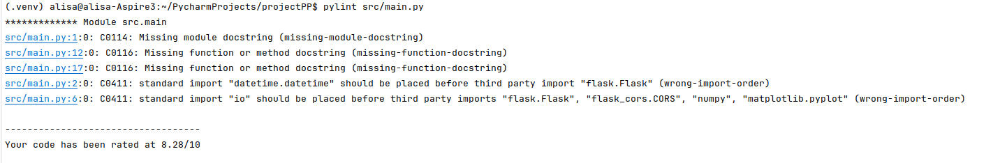
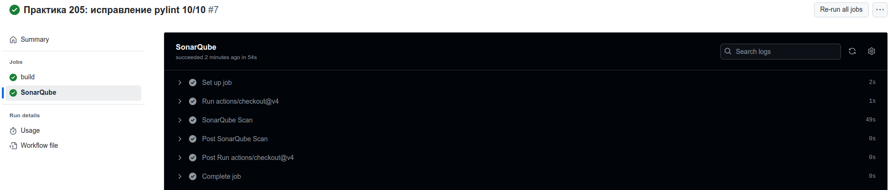
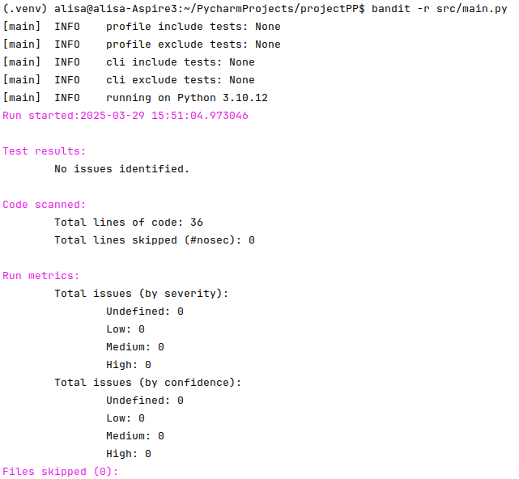

# Анализ ускорения CI/CD. Практическое занятие №5.

**Этапы:**

1. Set up job;
2. Run actions/checkout;
3. Run actions/setup-python;
4. Install dependencies, AVG;
5. Run tests;
6. Post Run actions/setup-python;
7. Post Run actions/checkout;
8. Run actions/cache;
9. Post Run actions/cache;
10. Run Pylint;

| Сценарий                                  | Этап 1, с | Этап 2, с | Этап 3, с | Этап 4, с | Этап 5, с | Этап 6, с | Этап 7, с | Этап 8, с | Этап 9, с | Этап 10, с | Ссылка                                                                         |
|-------------------------------------------|-----------|-----------|-----------|-----------|-----------|-----------|-----------|-----------|-----------|------------|--------------------------------------------------------------------------------|
| Минимальная сборка                        | 1         | 1         | 0         | 10        | 1         | 0         | 0         | -         | -         | -          | https://github.com/aF-i-v-e/projectPP/actions/runs/14146238965/job/39633875038 |
| Кэширование                               | 1         | 0         | 1         | 8         | 2         | 0         | 1         | 0         | 1         | -          | https://github.com/aF-i-v-e/projectPP/actions/runs/14146623969/job/39634686436 |
| Кэширование + SonarQube + PyLint          | 2         | 1         | 0         | 12        | 2         | 0         | 0         | 1         | 0         | 7          | https://github.com/aF-i-v-e/projectPP/actions/runs/14147072698/job/39635657779 |
| Кэширование + SonarQube + PyLint + Bandit |

**Результаты проверки pylint:**

**SonarQube:**

**Результаты проверки bandit**
