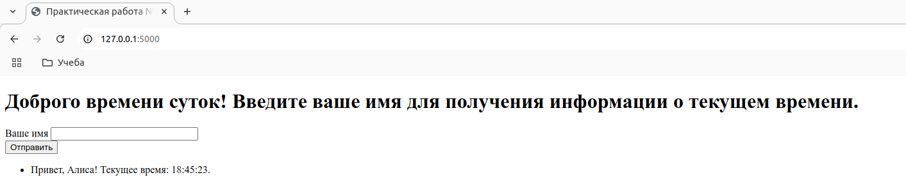
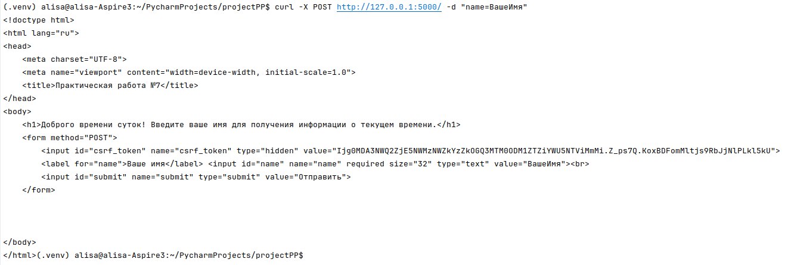
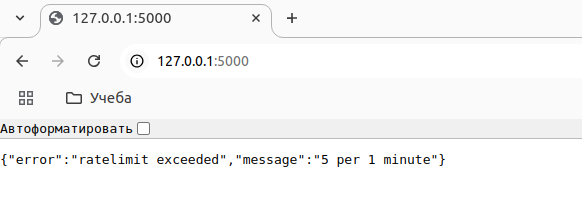
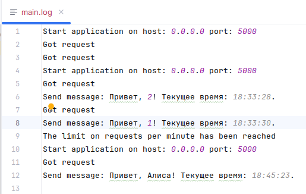
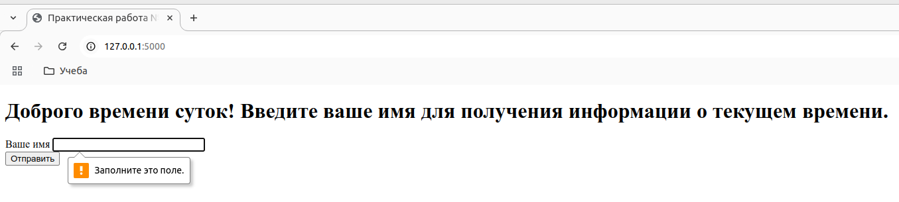
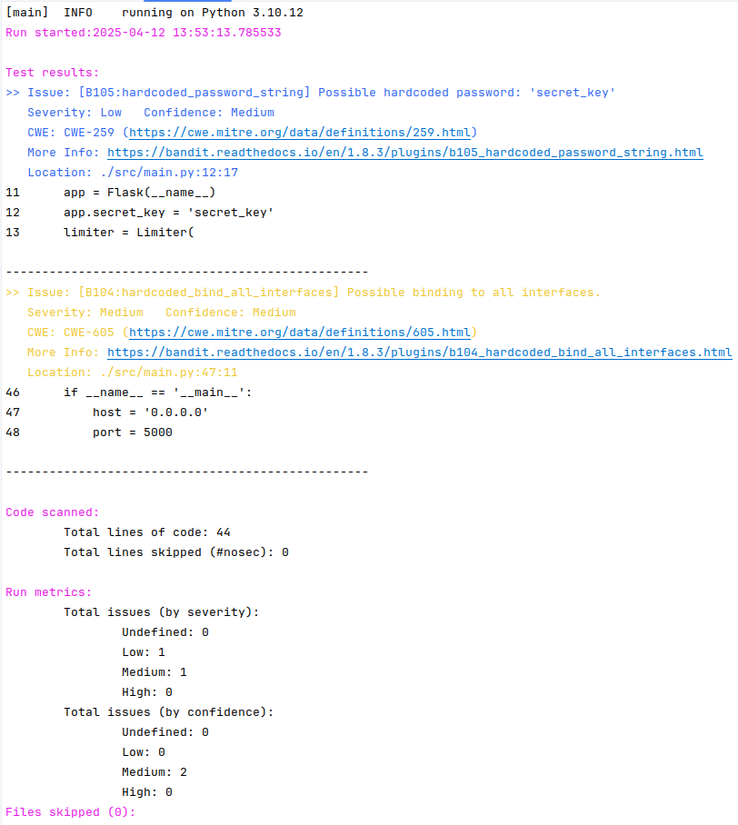

# Практическая работа №7

## Пример работы приложения:


## Использованные в проекте инструменты безопасности:
1. **Flask-WTF**

Инструмент добавляет защиту от межсайтовых подделок запросов (CSRF) для форм, позволяет предотвратить получение поддельных запросов от имени пользователя.

**Пример:**



Был добавлен тег `csrf_token`:
```commandline
 <input id="csrf_token" name="csrf_token" type="hidden" value="Ijg0MDA3NWQ2ZjE5NWMzNWZkYzZkOGQ3MTM0ODM1ZTZiYWU5NTViMmMi.Z_ps7Q.KoxBDFomMltjs9RbJjNlPLkl5kU">
```

2. **Flask-Limiter**

Инструмент для ограничения количества запросов, которые может сделать пользователь за определенный период времени (5 запросов в минуту).
Позволяет предотвратить атаки, в которых злоумышленник пытается отправить слишком много запросов за короткий промежуток времени.



3. **Логирование**

Инструмент для отслеживания событий и ошибок приложения. Позволяет обнаружить подозрительную активность (см. `main.log`).



4. **Валидация вводимого значения в форму**


5. **Bandit**

Инструмент статического анализа безопасности для Python, который помогает находить уязвимости в коде. Позволяет выявить потенциальные проблемы безопасности.

**Команда запуска:**
```commandline
bandit -r src/main.py
```

**Пример отчёта:**

