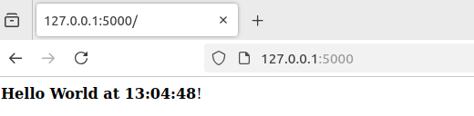
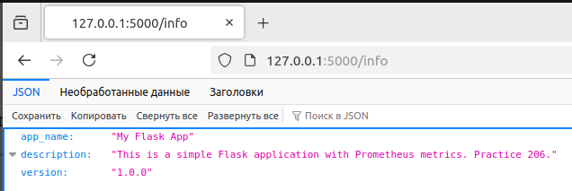
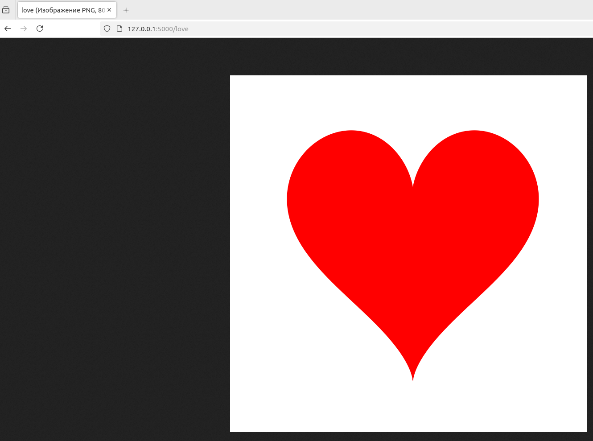
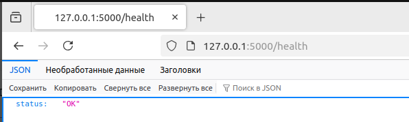
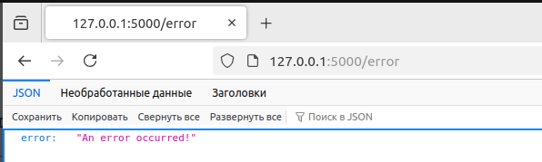
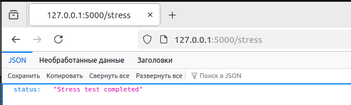

# Минимальный проект для сдачи работы #6 по курсу "Программная инженерия" 

## Доступные эндпоинты:

```commandline
http://127.0.0.1:5000
```


```commandline
http://127.0.0.1:5000/info
```


```commandline
http://127.0.0.1:5000/love
```


```commandline
http://127.0.0.1:5000/health
```


```commandline
http://127.0.0.1:5000/error
```


```commandline
http://127.0.0.1:5000/stress
```
