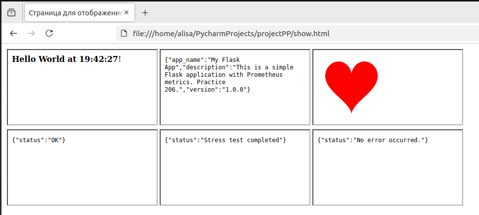

# Минимальный проект для сдачи работы #6 по курсу "Программная инженерия" 

## Перед запуском приложения:
```commandline
sudo systemctl start prometheus
sudo /bin/systemctl start grafana-server
```
## Доступные эндпоинты:

```commandline
http://127.0.0.1:5000
```


```commandline
http://127.0.0.1:5000/info
```


```commandline
http://127.0.0.1:5000/love
```


```commandline
http://127.0.0.1:5000/health
```


```commandline
http://127.0.0.1:5000/error
```


```commandline
http://127.0.0.1:5000/stress
```


Получение метрик:
```commandline
http://localhost:8000/metrics
```
```commandline
# HELP python_gc_objects_collected_total Objects collected during gc
# TYPE python_gc_objects_collected_total counter
python_gc_objects_collected_total{generation="0"} 806.0
python_gc_objects_collected_total{generation="1"} 573.0
python_gc_objects_collected_total{generation="2"} 0.0
# HELP python_gc_objects_uncollectable_total Uncollectable objects found during GC
# TYPE python_gc_objects_uncollectable_total counter
python_gc_objects_uncollectable_total{generation="0"} 0.0
python_gc_objects_uncollectable_total{generation="1"} 0.0
python_gc_objects_uncollectable_total{generation="2"} 0.0
# HELP python_gc_collections_total Number of times this generation was collected
# TYPE python_gc_collections_total counter
python_gc_collections_total{generation="0"} 190.0
python_gc_collections_total{generation="1"} 17.0
python_gc_collections_total{generation="2"} 1.0
# HELP python_info Python platform information
# TYPE python_info gauge
python_info{implementation="CPython",major="3",minor="10",patchlevel="12",version="3.10.12"} 1.0
# HELP process_virtual_memory_bytes Virtual memory size in bytes.
# TYPE process_virtual_memory_bytes gauge
process_virtual_memory_bytes 5.99478272e+08
# HELP process_resident_memory_bytes Resident memory size in bytes.
# TYPE process_resident_memory_bytes gauge
process_resident_memory_bytes 6.8513792e+07
# HELP process_start_time_seconds Start time of the process since unix epoch in seconds.
# TYPE process_start_time_seconds gauge
process_start_time_seconds 1.74386214271e+09
# HELP process_cpu_seconds_total Total user and system CPU time spent in seconds.
# TYPE process_cpu_seconds_total counter
process_cpu_seconds_total 1.6099999999999999
# HELP process_open_fds Number of open file descriptors.
# TYPE process_open_fds gauge
process_open_fds 7.0
# HELP process_max_fds Maximum number of open file descriptors.
# TYPE process_max_fds gauge
process_max_fds 1.048576e+06
# HELP app_requests_total Total HTTP requests
# TYPE app_requests_total counter
# HELP app_request_latency_seconds Request latency
# TYPE app_request_latency_seconds histogram
# HELP app_errors_total Total errors
# TYPE app_errors_total counter
# HELP app_request_processing_time_seconds Time spent processing requests
# TYPE app_request_processing_time_seconds summary
```

Открыть в браузере файл `/projectPP/show.html` для отображения работы всех эндпоинтов и генерации статистики.
